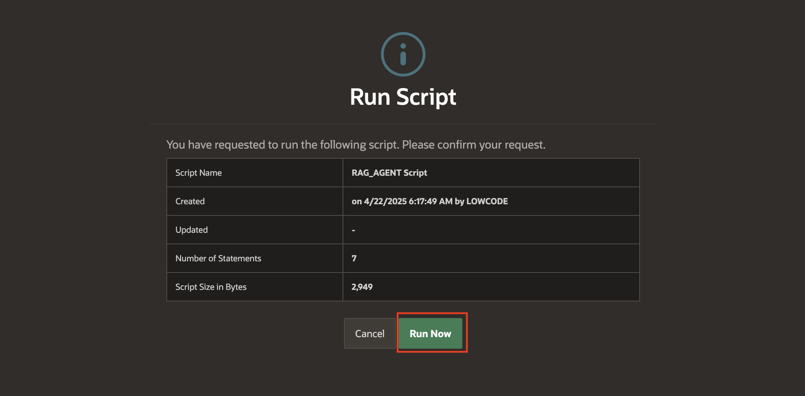
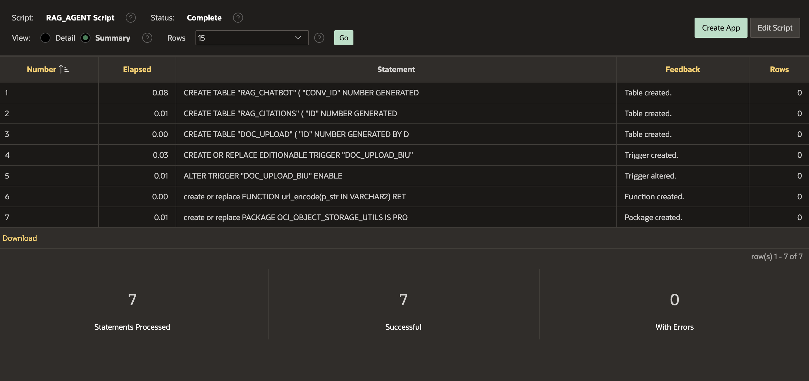
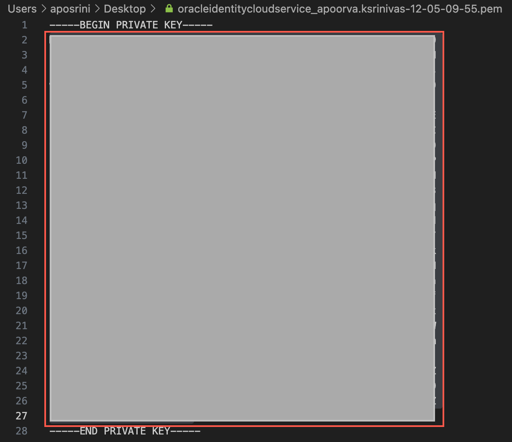
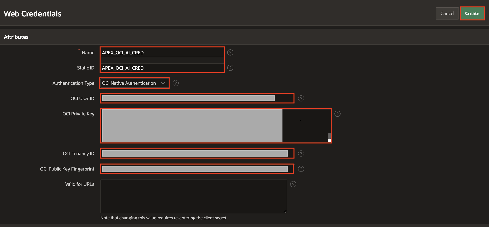

# Setup Tasks for Application Development

## Introduction

In this lab, you will run SQL commands using SQL Scripts. A SQL script can contain one or more SQL statements or PL/SQL blocks. You can use SQL scripts to create, edit, view, run, and delete database objects.
We are creating tables, triggers, sequences, functions, and a package to manage chatbot conversation data, document uploads, and interactions with OCI Object Storage.

Estimated Time: 10 Minutes

### Objectives

In this lab, you:

- Create database objects using SQL Scripts.

- Create Web Credentials.

## Task 1: Create database objects using SQL Scripts

>*Note: Explanation of Tables, Triggers, Sequences, Functions, and Packages:*

- *RAG_CHATBOT Table*: Stores chatbot conversation details like user comments, session IDs, and timestamps.

- *RAG_CITATIONS Table*: Stores citations related to chatbot responses, including the source and location of the information used.

- *DOC_UPLOAD Table*: Manages metadata for documents uploaded to OCI Object Storage, including file names, MIME types, and URLs.

- *DOC_UPLOAD_BIU Trigger*: Automatically updates creation and modification timestamps, as well as user information when documents are inserted or updated in the DOC_UPLOAD table.

- *INGESTION_SEQ Sequence*: Generates unique numeric IDs for tracking uploaded documents, starting at 401 and incrementing with each new record.

- *URL_ENCODE Function*: Encodes a string for safe use in URLs by escaping special characters to ensure proper transmission in HTTP requests.

- *OCI_OBJECT_STORAGE_UTILS Package*: Contains procedures to interact with OCI Object Storage, including uploading, retrieving, and deleting files from the cloud storage.

1. Log into your APEX Workspace. Click **'⌄'** next to **SQL Workshop** and select **SQL Scripts**.

    

2. Click **Create**.

    

3. Copy the following SQL code and paste it into the code editor:

      ```
      <copy>
      CREATE TABLE "RAG_CHATBOT" (
         "CONV_ID"      NUMBER
            GENERATED BY DEFAULT ON NULL AS IDENTITY MINVALUE 1 MAXVALUE 9999999999999999999999999999 INCREMENT BY 1 START WITH 1 CACHE 20
            NOORDER NOCYCLE NOKEEP NOSCALE
         NOT NULL ENABLE,
         "USER_NAME"    VARCHAR2(255 CHAR),
         "COMMENT_TEXT" VARCHAR2(4000 CHAR),
         "COMMENT_DATE" DATE,
         "IS_OWN"       VARCHAR2(10 CHAR),
         "SESSION_ID"   VARCHAR2(500),
         CONSTRAINT "RAG_CHATBOT_ID_PK" PRIMARY KEY ( "CONV_ID" )
            USING INDEX ENABLE
      );

      CREATE TABLE "RAG_CITATIONS" (
         "ID"              NUMBER
            GENERATED BY DEFAULT ON NULL AS IDENTITY MINVALUE 1 MAXVALUE 9999999999999999999999999999 INCREMENT BY 1 START WITH 1 CACHE 20
            NOORDER NOCYCLE NOKEEP NOSCALE
         NOT NULL ENABLE,
         "CONV_ID"         NUMBER,
         "PROMPT"          VARCHAR2(4000 CHAR),
         "SOURCE_TEXT"     VARCHAR2(4000 CHAR),
         "SOURCE_LOCATION" VARCHAR2(4000 CHAR),
         "ASKED_ON"        DATE,
         CONSTRAINT "RAG_CITATIONS_ID_PK" PRIMARY KEY ( "ID" )
            USING INDEX ENABLE
      );

      CREATE TABLE "DOC_UPLOAD" (
         "ID"                 NUMBER
            GENERATED BY DEFAULT ON NULL AS IDENTITY MINVALUE 1 MAXVALUE 9999999999999999999999999999 INCREMENT BY 1 START WITH 1 CACHE 20
            NOORDER NOCYCLE NOKEEP NOSCALE
         NOT NULL ENABLE,
         "FILE_NAME"          VARCHAR2(4000 CHAR),
         "MIME_TYPE"          VARCHAR2(4000 CHAR),
         "OBJECT_STORAGE_URL" VARCHAR2(4000 CHAR),
         "CREATED"            DATE NOT NULL ENABLE,
         "CREATED_BY"         VARCHAR2(255 CHAR) NOT NULL ENABLE,
         "UPDATED"            DATE NOT NULL ENABLE,
         "UPDATED_BY"         VARCHAR2(255 CHAR) NOT NULL ENABLE,
         "INGESTION_RESPONSE" VARCHAR2(100),
         "DATA_ING_JOB_ID"    VARCHAR2(300),
         CONSTRAINT "DOC_UPLOAD_ID_PK" PRIMARY KEY ( "ID" )
            USING INDEX ENABLE
      );

      CREATE OR REPLACE EDITIONABLE TRIGGER "DOC_UPLOAD_BIU" BEFORE
         INSERT OR UPDATE ON DOC_UPLOAD
         FOR EACH ROW
      BEGIN
         IF INSERTING THEN
            :NEW.CREATED := SYSDATE;
            :NEW.CREATED_BY := COALESCE(
                  SYS_CONTEXT('APEX$SESSION', 'APP_USER'),
                  USER
            );
         END IF;

         :NEW.UPDATED := SYSDATE;
         :NEW.UPDATED_BY := COALESCE(
            SYS_CONTEXT('APEX$SESSION', 'APP_USER'),
            USER
         );
      END DOC_UPLOAD_BIU;
      /

      ALTER TRIGGER "DOC_UPLOAD_BIU" ENABLE;

      /

      CREATE SEQUENCE "INGESTION_SEQ" MINVALUE 1 MAXVALUE 999999999999999999999999999 INCREMENT BY 1 START WITH 401 CACHE 20 NOORDER NOCYCLE
      NOKEEP NOSCALE GLOBAL;

      /
      CREATE OR REPLACE FUNCTION URL_ENCODE (
         P_STR IN VARCHAR2
      ) RETURN VARCHAR2 IS
      BEGIN
         RETURN SYS.UTL_URL.ESCAPE(
            URL                   => P_STR,
            ESCAPE_RESERVED_CHARS => TRUE,
            URL_CHARSET           => 'AL32UTF8'
         );
      END URL_ENCODE;
      /

      CREATE OR REPLACE PACKAGE OCI_OBJECT_STORAGE_UTILS IS
         PROCEDURE UPLOAD_FILE (
            P_FILE_CONTENT       IN VARCHAR2,
            P_STATIC_ID          IN VARCHAR2,
            P_NAMESPACE          IN VARCHAR2,
            P_BUCKET             IN VARCHAR2,
            P_REGION             IN VARCHAR2,
            P_OBJECT_STORAGE_URL OUT VARCHAR2,
            P_FILE_NAME          OUT VARCHAR2,
            P_MIME_TYPE          OUT VARCHAR2
         );

         PROCEDURE GET_FILE (
            P_ID IN NUMBER
         );

         PROCEDURE DELETE_FILE (
            P_OBJECT_STORAGE_URL IN VARCHAR2,
            P_STATIC_ID          IN VARCHAR2,
            P_MIME_TYPE          IN VARCHAR2
         );

      END OCI_OBJECT_STORAGE_UTILS;
      /

      CREATE OR REPLACE PACKAGE BODY OCI_OBJECT_STORAGE_UTILS IS

      PROCEDURE UPLOAD_FILE (
         P_FILE_CONTENT       IN VARCHAR2,
         P_STATIC_ID          IN VARCHAR2,
         P_NAMESPACE          IN VARCHAR2,
         P_BUCKET             IN VARCHAR2,
         P_REGION             IN VARCHAR2,
         P_OBJECT_STORAGE_URL OUT VARCHAR2,
         P_FILE_NAME          OUT VARCHAR2,
         P_MIME_TYPE          OUT VARCHAR2
      ) IS
         L_OBJECT   BLOB;
         L_RESPONSE CLOB;
      BEGIN
         SELECT
               BLOB_CONTENT,
               FILENAME,
               MIME_TYPE
         INTO
               L_OBJECT,
               P_FILE_NAME,
               P_MIME_TYPE
         FROM
               APEX_APPLICATION_TEMP_FILES
         WHERE
               NAME = P_FILE_CONTENT;

         P_OBJECT_STORAGE_URL := 'https://objectstorage.'
                                 || P_REGION
                                 || '.oraclecloud.com/n/'
                                 || P_NAMESPACE
                                 || '/b/'
                                 || P_BUCKET
                                 || '/o/'
                                 || URL_ENCODE(P_FILE_NAME);

         APEX_WEB_SERVICE.G_REQUEST_HEADERS(1).NAME := 'Content-Type';
         APEX_WEB_SERVICE.G_REQUEST_HEADERS(1).VALUE := P_MIME_TYPE;
         L_RESPONSE := APEX_WEB_SERVICE.MAKE_REST_REQUEST(
               P_URL                  => P_OBJECT_STORAGE_URL,
               P_HTTP_METHOD          => 'PUT',
               P_BODY_BLOB            => L_OBJECT,
               P_CREDENTIAL_STATIC_ID => P_STATIC_ID
         );

         IF APEX_WEB_SERVICE.G_STATUS_CODE != 200 THEN
               RAISE_APPLICATION_ERROR(-20000, 'Upload failed - ' || APEX_WEB_SERVICE.G_STATUS_CODE);
         END IF;

      END UPLOAD_FILE;

      PROCEDURE GET_FILE (
         P_ID IN NUMBER
      ) IS

         L_BLOB      BLOB;
         L_URL       VARCHAR2(255);
         L_MIME_TYPE VARCHAR2(50);
         L_FILE_NAME VARCHAR2(100);
      BEGIN
         SELECT
               MIME_TYPE,
               OBJECT_STORAGE_URL,
               FILE_NAME
         INTO
               L_MIME_TYPE,
               L_URL,
               L_FILE_NAME
         FROM
               DOC_UPLOAD
         WHERE
               ID = P_ID;

         L_BLOB := APEX_WEB_SERVICE.MAKE_REST_REQUEST_B(
               P_URL                  => L_URL,
               P_HTTP_METHOD          => 'GET',
               P_CREDENTIAL_STATIC_ID => 'APEX_OCI_AI_CRED'
         );

         APEX_HTTP.DOWNLOAD(
               P_BLOB         => L_BLOB,
               P_CONTENT_TYPE => L_MIME_TYPE,
               P_FILENAME     => L_FILE_NAME
         );

         APEX_APPLICATION.STOP_APEX_ENGINE;
      END GET_FILE;

      PROCEDURE DELETE_FILE (
         P_OBJECT_STORAGE_URL IN VARCHAR2,
         P_STATIC_ID          IN VARCHAR2,
         P_MIME_TYPE          IN VARCHAR2
      ) IS
         L_RESPONSE CLOB;
      BEGIN
         APEX_WEB_SERVICE.G_REQUEST_HEADERS(1).NAME := 'Content-Type';
         APEX_WEB_SERVICE.G_REQUEST_HEADERS(1).VALUE := P_MIME_TYPE;
         L_RESPONSE := APEX_WEB_SERVICE.MAKE_REST_REQUEST(
               P_URL                  => P_OBJECT_STORAGE_URL,
               P_HTTP_METHOD          => 'DELETE',
               P_CREDENTIAL_STATIC_ID => P_STATIC_ID
         );

      END DELETE_FILE;

      END OCI_OBJECT_STORAGE_UTILS;
     /
     </copy>
      ```

4. For **Script Name**: Enter **Application Scripts** and click **Run**.

   

5. On the Run Script page, click **Run Now**.

    

6. The Results page shows the results of running the script. Scroll to the bottom to see a summary. You should not see any errors.

    

## Task 2: Create Web Credentials in Oracle APEX

Web credentials authenticate the connection to external REST services or REST-Enabled SQL services from APEX.

Creating Web Credentials securely stores and encrypts authentication credentials for use by Oracle APEX components and APIs. Credentials cannot be retrieved back in clear text. They are stored at the workspace level and, therefore, visible to all applications.

To create a Web Credential in Oracle APEX:

1. On the Workspace home page, navigate to **App Builder**.

   

2. Click **Workspace Utilities**.

   

3. Select **Web Credentials**.

   

4. Click **Create**.

   

5. Enter/select the following details using the configuration file you copied in the previous task.

    - Name: **APEX\_OCI\_AI\_CRED**

    - Static ID: **APEX\_OCI\_AI\_CRED**

    - Authentication Type: **OCI Native Authentication**

    - OCI User ID: Enter the OCID of the Oracle Cloud user Account. The OCID is in the Configuration File Preview generated during the API Key creation.
    Your OCI User ID looks similar to **ocid1.user.oc1..aaaaaaaa\*\*\*\*\*\*wj3v23yla**

    - OCI Private Key: Open the private key (.pem file) downloaded in the previous task. Copy and paste the API Key.

    

    - OCI Tenancy ID: Enter the OCID for Tenancy. Your Tenancy ID looks similar to **ocid1.tenancy.oc1..aaaaaaaaf7ush\*\*\*\*cxx3qka**

    - OCI Public Key Fingerprint: Enter the Fingerprint ID. Your Fingerprint ID looks similar to **a8:8e:c2:8b:fe:\*\*\*\*:ff:4d:40**

   

6. Click **Create**.

   

## Summary

You've gained the skills to create database objects using SQL Scripts, and set up web credentials.

You're now ready to move on to the next lab!

## Acknowledgements

- **Author(s)** - Roopesh Thokala, Senior Product Manager
- **Last Updated By/Date** - Shailu Srivastava, Product Manager, May 2025
